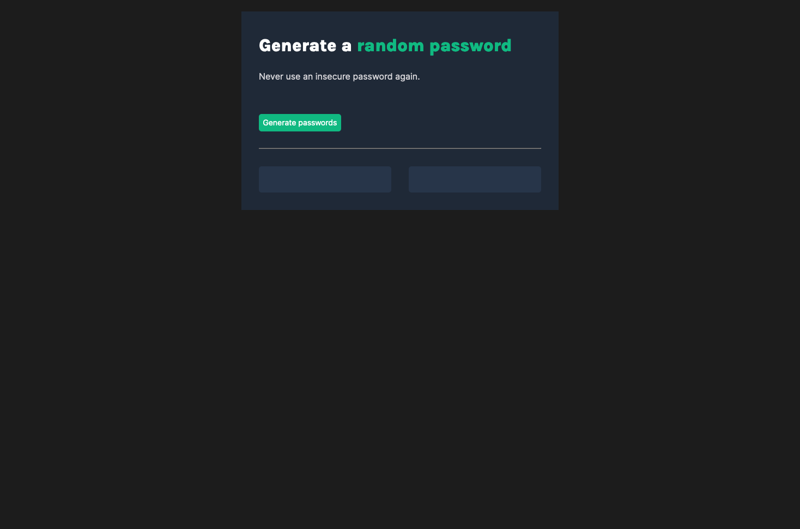

# Password Generator
My solution to the [Password Generator solo project](https://www.sololearn.com/learning/1024) from [Scrimba.com's Frontend Developer Career Path](https://scrimba.com/learn/frontend).

## Contents

- [Overview](#overview)
- [Screenshot](#screenshot)
- [My Process](#my-process)
- [Status](#status)

## Overview

Build a password generator with HTML, CSS, and JavaScript. The generator should do the following: 

- randomly generate two passwords
- password length should be 15 characters

## Screenshot

## My Process

The goals for this project were to build a password generator from scrach in line with the Figma design specfications. I started with outline the HTML to include the needed elements (e.g., header, text, button, etc.) before proceeding to the CSS to style the page. Finally, I added the JavaScript variables and functions to generate the random passwords. The JavaScript makes use of a `for` loop, and the `Math.floor()` and `Math.random()` methods to generator 15 different random numbers. These are then used as indices for an array with the characters.

### Built with

- HTML
- CSS
- JavaScript

## Status

Live version: [https://ananfito.github.io/password-generator]

## Connect

- [LinkedIn](https://linkedin.com/in/anthonynanfito)
- [Portfolio](https://ananfito.github.io)
- [Blog](https://ananfito.hashnode.dev)